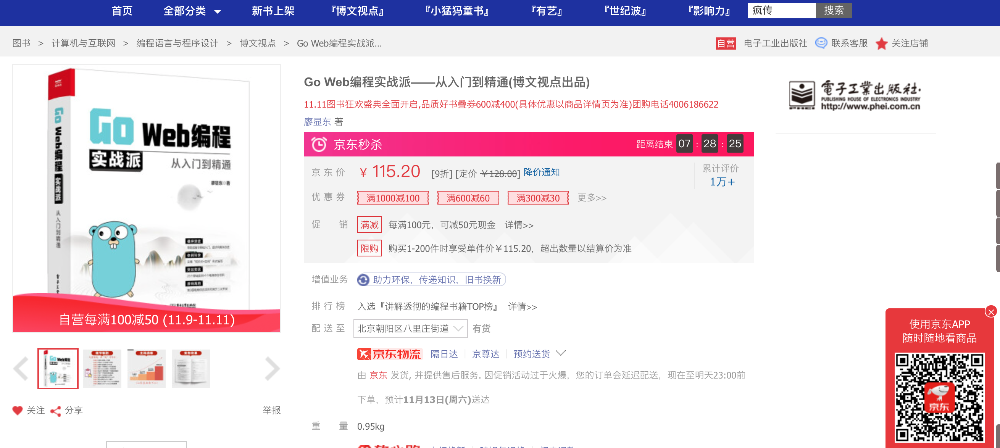

#  🔥🔥拒绝内卷！拒绝内卷！拒绝内卷！
#  🔥🔥Go语言这么火，再不学Go语言，你就Out了！一起学习挑战30天拿到高薪offer！！
####  先看看拉钩上Go语言薪资，你心动吗？心动就一起学习Go语言吧～

#  源码说明
#### （1）作者历时1年多编写的代码免费开源啦！
#### （2）代码采用目前go最新版本编写。
#### （3）所有的代码都是经过反复测试过，精益求精，下载下来即可运行！
#### （4）实例代码是绝大部分都是来自于最新的企业实战项目。
#### （5）配套图书内容丰富，全书536页！零基础入门，循序渐进，实现快速从菜鸟向实战派高手迈进！精品教程，实力说话，已经被引进到🔥🔥🔥 台湾销售！
#### （6）欢迎购买纸质图书，进行更加系统地学习，快速从小白向顶尖高手迈进，购买链接如下：
#### 当当（🔥🔥🔥🔥🔥🔥 活动抢购中......）：http://product.dangdang.com/29225055.html
#### 京东（🔥🔥🔥🔥🔥🔥 活动抢购中......）：https://item.jd.com/13200972.html

#### 天猫（🔥🔥🔥🔥🔥🔥 活动抢购中......）：https://detail.tmall.com/item.htm?id=643246918641

#### 🔥🔥🔥 精品教程，实力说话，台湾繁体版正式出版销售：

#### 京东（🔥🔥🔥🔥🔥🔥 台湾繁体版......）：https://item.jd.com/10040646929728.html
# 拒绝纯理论，直接实战！实战！实战！干货如下：
#### 系统学习Go语言基础知识；
#### 掌握HTTP基本原理；
#### 掌握Go Web 底层原理；
#### 掌握Go访问MySQL、Redis、MongoDB的方法和技巧；
#### 掌握Gorm、Beego ORM的使用方法和技巧；
#### 掌握Go Socket编程的方法和技巧；
#### 掌握用gRPC实现微服务调用；
#### 掌握Go 文件处理的方法和技巧；
#### 掌握Go JSON、XML生成与解析方法和技巧；
#### 掌握Go正则表达式的处理方法和技巧；
#### 掌握Go 日志处理的方法和技巧；
#### 掌握从数据库中导出一个csv文件的实战法；
#### 掌握Go并发编程的底层原理
#### 掌握常见Go并发Web应用的实战开发方法和技巧
#### 掌握Go开发并发的Web爬虫的方法和技巧
#### 掌握Gin框架、Beego框架的使用方法和技巧；
#### 掌握流行架构风格RESTful API接口开发；
#### 掌握用Go开发OAuth2.0接口技巧；
#### 掌握Elasticsearch的使用方法；
#### 掌握微信支付、支付宝支付接口对接方法；
#### 掌握Go语言开发的B2C电子商务系统开发的整个流程方案及源码；
#### 掌握Docker实战部署方法；
#### 掌握Docker Compose实战部署方法。
# 《Go Web编程实战派从入门到精通》介绍

## 1.本书特色
本书聚焦Go Web开发领域，对Go Web知识进行全面深入地讲解。本书有如下特色：
#### （1）一线技术，突出实战；
本书以实战为核心，贯穿整本书。所有代码采用Go最新版本编写。
#### （2）精雕细琢，阅读性强；
全书的语言经过多次打磨，力求精确。同时注重阅读体验，让没有任何基础的读者也可以很轻松的读懂书中的知识。
#### （3）零基础入门，循序渐进，实现快速从菜鸟向实战派高手迈进；
本书以Go入门级程序员为主要对象，初、中、高级程序员都可以从书中学到干货。先从Go的基础学起，然后学习Go核心的技术，再学Go的高级应用，然后再进行项目实战，最后介绍应用程序的Docker实战部署。全书从最基础的知识讲解一步一步到最核心的B2C电子商务系实战开发，真正帮助读者从基础入门向开发高手迈进。
#### （4）极客思维，极致效率；
本书以极客思维、深入Go语言底层进行探究，帮助读者了解背后原理。全书言简意赅，以帮助读者提升开发效率为导向，同时尽可能帮助读者缩短阅读本书的时间。
#### （5）由易到难，重难点标注并重点解析；
本书编排由易到难，内容基本覆盖Go Web的主流前沿技术。同时对重难点进行重点讲解，对易错点和注意点进行了提示说明，帮助读者克服学习过程中的困难。
#### （6）突出实战，快速突击；
本书的实例代码是绝大部分都是来自于最新的企业实战项目。对于购买本书的读者，所有的源代码均可以通过网上下载，直接下载即可运行，让读者通过实践来加深理解。
#### （7）实战方案，可直接二次开发进行实战部署；
本书全书以实战为主，所有的示例代码，拿来即可运行。特别是第9章，购买本书的读者可以直接获得B2C电子商务系统的全部源代码。可以直接作为电商项目进行二次开发，用于读者的项目。读者购买本书不仅可以学习本书的各种知识，也相当于购买一个最新版的Go语言电商系统解决方案及项目源码。
## 2.阅读本书，您能学到什么
#### 系统学习Go语言基础知识；
#### 掌握HTTP基本原理；
#### 掌握Go Web 底层原理；
#### 掌握Go访问MySQL、Redis、MongoDB的方法和技巧；
#### 掌握Gorm、Beego ORM的使用方法和技巧；
#### 掌握Go Socket编程的方法和技巧；
#### 掌握用gRPC实现微服务调用；
#### 掌握Go 文件处理的方法和技巧；
#### 掌握Go JSON、XML生成与解析方法和技巧；
#### 掌握Go正则表达式的处理方法和技巧；
#### 掌握Go 日志处理的方法和技巧；
#### 掌握从数据库中导出一个csv文件的实战法；
#### 掌握Go并发编程的底层原理
#### 掌握常见Go并发Web应用的实战开发方法和技巧
#### 掌握Go开发并发的Web爬虫的方法和技巧
#### 掌握Gin框架、Beego框架的使用方法和技巧；
#### 掌握流行架构风格RESTful API接口开发；
#### 掌握用Go开发OAuth2.0接口技巧；
#### 掌握Elasticsearch的使用方法；
#### 掌握微信支付、支付宝支付接口对接方法；
#### 掌握Go语言开发的B2C电子商务系统开发的整个流程方案及源码；
#### 掌握Docker实战部署方法；
#### 掌握Docker Compose实战部署方法。
希望通过本书的学习，能够让读者快速、系统地掌握Go Web开发的各种方法和技巧，帮助读者在Go 语言Web开发中，快速从基础入门向精通级的实战派高手迈进。
## 读者对象
本书从Go语言基础开始，从基础原理到高级项目实战，既适合Go语言初学者，也适合想进一步提升的中高级开发者，初级、中级、高级开发人员都能学到干货。
本书读者对象如下：
#### 1.初学编程的自学者；	
#### 2.Go语言初学者；	
#### 3.Go语言中高级开发人员；	
#### 4.Web开发工程师；	
#### 5.编程爱好者；	
#### 6.大中专院校的老师和学生；
#### 7.培训机构的老师和学员；
#### 8.相关专业的大学毕业学生；
#### 9.Web前端开发人员；
#### 10.测试工程师；
#### 11.DevOps运维人员；
#### 12.Web中高级开发人员。

## 3.技术交流
假如读者在阅读本书的过程中有任何疑问，请用手机微信扫描下方二维码，

关注“源码大数据”公众号，输入读者遇到的问题，作者会第一时间与读者进行交流回复。

读者也可以添加QQ:823923263进行交流反馈。

尽管作者在本书写作过程中尽可能地保持严谨，但难免有纰漏之处，欢迎读者通过“源码大数据”公众号或者QQ群等方式批评指正。

注意：本仓库不包含商城项目，要获取商城项目源码，请购买本书通过前言的说明获取。
